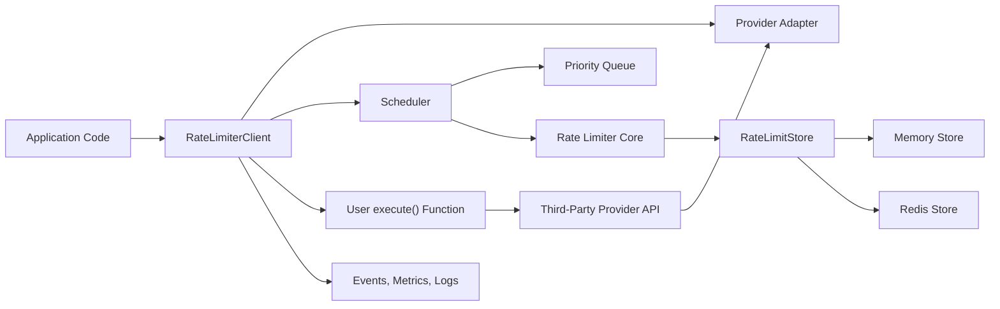
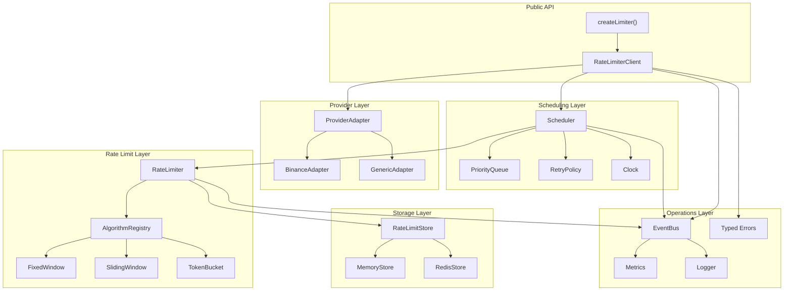
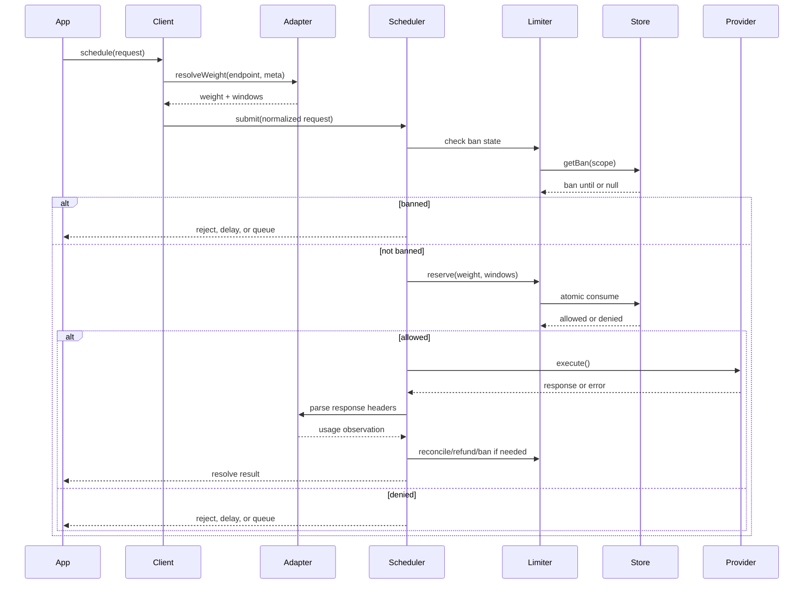
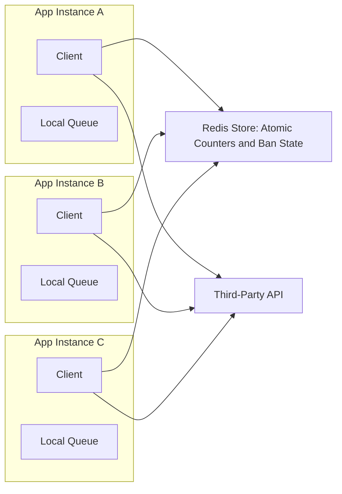

# Architecture - Distributed Rate Limit and Request Scheduling Manager

## 1. Executive Summary

This document defines the software architecture for a reusable TypeScript/NPM library that protects applications from third-party API rate-limit violations while preserving throughput, fairness, and operational visibility.

The library is designed for providers that enforce weighted, window-based limits such as Binance, where different endpoints consume different request weights. It supports single-process applications through an in-memory store and horizontally scaled deployments through Redis-backed atomic counters.

The architecture is intentionally layered:

- Public API remains small and ergonomic.
- Provider-specific behavior is isolated in adapters.
- Scheduling decisions are separated from rate-limit accounting.
- Algorithms are pluggable.
- Storage is the boundary between local and distributed execution.
- Observability is built in, not bolted on later.

The primary architectural principle is conservative execution: the system reserves capacity before executing a request, then reconciles with provider feedback afterward. This avoids accidental overshoot, which is more expensive than temporary underutilization for APIs that can ban clients.

## 2. Architecture Goals

### 2.1 Functional Goals

- Track weighted usage per provider, account, endpoint, and configured window.
- Support fixed window, sliding window, and future token-bucket algorithms.
- Schedule requests using reject, delay, and queue strategies.
- Prioritize critical traffic while preventing starvation.
- Handle retries, cooldowns, bans, and provider feedback headers.
- Support multiple providers in the same application.
- Support local and distributed deployments.

### 2.2 Quality Attributes

- Correctness: never knowingly execute a request that exceeds a configured policy.
- Predictability: scheduling behavior should be explainable and deterministic under a mock clock.
- Throughput: keep the hot path efficient and avoid unnecessary remote round trips.
- Resilience: behave explicitly during Redis outages, provider bans, process crashes, and retry storms.
- Extensibility: add providers, algorithms, and stores without changing public API semantics.
- Observability: emit events, metrics, and structured diagnostic data for all meaningful decisions.
- Developer experience: provide a clean TypeScript API with strong types, sensible defaults, and minimal ceremony.

## 3. System Context



The library does not own HTTP transport. Instead, the caller provides an `execute()` function or wraps an existing async function. This keeps the library transport-agnostic and compatible with `fetch`, `axios`, SDK clients, custom signing logic, and test doubles.

## 4. Architectural Style

The architecture follows a hexagonal style:

- The core domain is request scheduling and rate-limit accounting.
- Provider adapters translate external provider rules into internal policies.
- Storage adapters handle persistence and atomicity.
- Observability adapters export events and metrics.
- The public client is a facade over the internal orchestration.

This separation prevents provider-specific behavior from leaking into algorithms and prevents distributed storage concerns from leaking into scheduler logic.

## 5. Component Model



## 6. Component Responsibilities

### 6.1 RateLimiterClient

The client is the user-facing facade.

Responsibilities:

- Validate user input and normalize request options.
- Resolve endpoint weights through the provider adapter.
- Delegate scheduling to the scheduler.
- Expose `schedule()`, `execute()`, `wrap()`, `stats()`, `on()`, and `drain()`.
- Convert internal failures into stable typed errors.
- Preserve request result typing.

The client should not implement rate-limit algorithms, queue mechanics, or provider-specific parsing.

### 6.2 ProviderAdapter

Provider adapters own provider knowledge.

Responsibilities:

- Resolve endpoint weight from endpoint, method, metadata, or request payload.
- Map provider-specific headers into internal usage observations.
- Detect ban, cooldown, and retry-after conditions.
- Provide default windows and endpoint policies.
- Classify provider errors such as HTTP 429, 418, 503, or SDK-specific error objects.

Provider adapters are the only layer that should know about headers such as `X-MBX-USED-WEIGHT-1M`.

### 6.3 Scheduler

The scheduler is the decision engine.

Responsibilities:

- Decide whether a request is executed, rejected, delayed, or queued.
- Coordinate queue draining.
- Respect ban state and cooldowns.
- Apply priority, aging, timeout, cancellation, and backpressure policies.
- Trigger retries using the retry policy.
- Emit lifecycle events.

The scheduler should be deterministic when driven by an injected clock and store test double.

### 6.4 PriorityQueue

The queue stores requests that cannot execute immediately.

Responsibilities:

- Order by effective priority.
- Preserve FIFO order among equal priority requests.
- Apply aging to reduce starvation.
- Enforce maximum queue size.
- Support removal on timeout or cancellation.
- Expose depth and waiting-time statistics.

For v1, each process owns a local queue. Distributed correctness is provided by the shared store, not by a globally ordered queue.

### 6.5 RateLimiter

The rate limiter coordinates algorithm and storage operations.

Responsibilities:

- Consume capacity across one or more windows.
- Ensure all-or-nothing reservation for multi-window policies.
- Calculate retry-after estimates.
- Refund capacity when appropriate.
- Reconcile local assumptions with provider-reported usage.
- Read and write shared ban state.

The rate limiter works with normalized internal policies and does not know provider details.

### 6.6 Algorithms

Algorithms define how usage is measured inside a window.

Required algorithms:

- Sliding window counter: default for v1 because it balances accuracy and cost.
- Fixed window: required for providers that publish reset-based policies.
- Token bucket: useful for burst-tolerant providers, likely v2 or late v1.

Each algorithm must expose the same behavior contract:

- `consume()`
- `getUsage()`
- `refund()`
- `estimateRetryAfter()`
- `cleanup()` where needed

### 6.7 RateLimitStore

The store is the main abstraction boundary for distributed behavior.

Responsibilities:

- Persist usage counters or event windows.
- Provide atomic consume operations.
- Provide ban state.
- Support refund and reconciliation.
- Use a consistent clock source where needed.

Implementations:

- `MemoryStore`: fast, local, deterministic, suitable for single-process use and tests.
- `RedisStore`: distributed, atomic, suitable for horizontally scaled applications.

### 6.8 EventBus, Metrics, and Logger

Observability components make operational behavior visible.

Responsibilities:

- Emit typed lifecycle events.
- Convert events into metrics.
- Provide structured logs at appropriate levels.
- Avoid throwing user-facing errors from observer handlers.
- Keep the hot path lightweight.

## 7. Core Domain Concepts

### 7.1 Provider

A provider is an external API namespace with its own rate-limit rules. Examples include Binance, Coinbase, Kraken, OKX, and internal services.

### 7.2 Scope

A scope defines where a limit applies. Typical scopes:

- Provider-level: all Binance requests.
- Account-level: one API key or account.
- Endpoint-level: specific route or operation.
- IP-level: shared public egress IP.
- Custom: user-defined dimension such as tenant or region.

The architecture should model scope explicitly because real providers often apply several limits at once.

### 7.3 Window

A window defines `windowMs`, `maxWeight`, and algorithm. One request can consume capacity from multiple windows.

Example:

```ts
[
  { id: '10s', windowMs: 10_000, maxWeight: 50, algorithm: 'sliding' },
  { id: '1m', windowMs: 60_000, maxWeight: 100, algorithm: 'sliding' }
]
```

### 7.4 Reservation

A reservation is capacity consumed before execution. It protects the application from overshooting provider limits.

Reservations should include:

- Request id
- Provider
- Scope key
- Window ids
- Weight
- Expiration time

Reservation TTLs protect against process crashes and abandoned requests.

## 8. Request Lifecycle



## 9. Scheduling Semantics

### 9.1 Reject Strategy

Reject immediately when capacity is unavailable.

Use for:

- Analytics
- Optional synchronization
- Non-critical polling
- User flows where stale data is acceptable

Error:

```ts
RateLimitError {
  code: 'RATE_LIMITED',
  retryAfterMs,
  provider,
  endpoint,
  weight
}
```

### 9.2 Delay Strategy

Sleep until capacity is expected to become available, then retry reservation.

Use for:

- Simple scripts
- Background workers
- Low-volume applications that do not need explicit queue management

Delay must honor request timeout and cancellation.

### 9.3 Queue Strategy

Place the request into a priority queue and execute it later.

Use for:

- Critical workflows
- Trading operations
- Balance synchronization
- Provider calls that must eventually happen

Queue behavior must be bounded by:

- `maxQueueSize`
- `maxWaitMs`
- request `timeoutMs`
- optional overflow policy

## 10. Priority and Fairness

Priority should be simple enough to reason about in production.

Recommended model:

- Integer priority from 0 to 100.
- Higher values execute sooner.
- Default priority is 50.
- FIFO tie-breaker for equal priority.
- Aging increases effective priority over time.

Effective priority:

```ts
effectivePriority = basePriority + floor(waitMs / agingIntervalMs) * agingStep
```

This prevents low-priority work from being permanently starved during sustained high-priority load.

## 11. Distributed Architecture



For v1, use local queues and a global Redis counter. This is the best tradeoff for most systems:

- Atomic Redis operations preserve global correctness.
- Local queues avoid a coordination-heavy global scheduler.
- Each instance can continue making independent progress.
- Operational complexity remains reasonable.

A distributed queue such as Redis Streams can be added later when strict global ordering is more important than latency and simplicity.

## 12. Redis Atomicity Model

Redis operations must be atomic for correctness. Multi-window reservations must succeed or fail as a unit.

The Redis store should use Lua scripts for:

- Consume across one or more windows.
- Roll back partial reservations.
- Read Redis server time.
- Maintain reservation TTL.
- Update ban state.

Important details:

- Use Redis `TIME` to avoid cross-node clock skew.
- Use hash tags in keys if Redis Cluster is supported.
- Keep script return values compact and typed.
- Version scripts and load by SHA where possible.
- Use bounded key cardinality to avoid unplanned memory growth.

Example key shape:

```text
rl:{provider}:{scope}:{windowId}:usage
rl:{provider}:{scope}:ban
rl:{provider}:{scope}:reservations
```

## 13. Failure Modes and Decisions

### 13.1 Redis Unavailable

The library must make this behavior explicit.

Modes:

- `failClosed`: reject or queue requests because capacity cannot be proven.
- `failOpen`: execute requests without global protection.
- `fallbackToMemory`: use local memory temporarily with warning events.

Recommended default for production: `failClosed`.

### 13.2 Provider Returns 429 or Ban Response

When the provider indicates rate limiting:

- Parse `Retry-After` when present.
- Fall back to adapter-specific cooldown.
- Store ban state in the shared store.
- Pause queue draining for affected scope.
- Retry only when policy allows.
- Apply jitter to avoid a synchronized restart.

### 13.3 Process Crash After Reservation

Reservations should expire automatically.

Mitigation:

- Store reservation id with TTL.
- Use request timeout as reservation TTL baseline.
- Periodically clean expired reservations in memory mode.
- Prefer small TTL caps for short provider calls.

### 13.4 Provider Header Mismatch

Provider-reported usage is more authoritative than local estimates.

When headers show higher usage:

- Reconcile store upward.
- Emit `usage:reconciled`.
- Consider near-limit or cooldown behavior.

When headers show lower usage:

- Be conservative.
- Optionally reconcile downward only if adapter marks the header as authoritative.

## 14. Backpressure Model

Backpressure prevents the library from becoming an unbounded memory buffer.

Controls:

- `maxQueueSize`
- `maxQueueWeight`
- `maxRequestTimeoutMs`
- `overflowPolicy`
- `maxConcurrentExecutions`
- `providerCooldownMs`

Overflow policies:

- `reject-new`: reject incoming request.
- `drop-lowest-priority`: remove lowest-priority queued request.
- `drop-oldest`: remove oldest queued request.

Recommended v1 default: `reject-new`.

## 15. Concurrency Model

The system separates capacity from execution concurrency.

Rate-limit capacity answers: may this request be sent?

Execution concurrency answers: how many user functions may run at once?

Both limits matter. A provider may allow 100 weight per minute, but the application may still want only 10 concurrent outbound calls.

Recommended config:

```ts
{
  maxConcurrentExecutions: 32,
  defaultStrategy: 'queue',
  maxQueueSize: 10_000
}
```

The scheduler must avoid holding internal locks while running user-provided `execute()` functions.

## 16. Public API Shape

```ts
const limiter = createLimiter({
  provider: new BinanceAdapter(),
  store: new RedisStore({ url: process.env.REDIS_URL }),
  defaultStrategy: 'queue',
  maxQueueSize: 10_000,
  maxConcurrentExecutions: 32,
  onError: 'failClosed'
});

const result = await limiter.schedule({
  endpoint: '/api/v3/order',
  priority: 90,
  strategy: 'queue',
  timeoutMs: 5_000,
  retry: {
    maxAttempts: 3,
    backoff: 'exponential',
    baseMs: 200,
    maxMs: 5_000,
    jitter: true,
    respectRetryAfter: true
  },
  execute: () => placeOrder(payload)
});
```

The API should optimize for clarity over cleverness. The caller should always be able to answer: what endpoint was scheduled, what weight was used, what strategy was applied, and why did it wait or fail?

## 17. Configuration Model

Recommended top-level configuration:

```ts
interface RateLimiterOptions {
  provider: ProviderAdapter;
  store?: RateLimitStore;
  clock?: Clock;
  defaultStrategy?: RequestStrategy;
  maxQueueSize?: number;
  maxQueueWeight?: number;
  maxConcurrentExecutions?: number;
  aging?: AgingConfig;
  overflowPolicy?: OverflowPolicy;
  redisFailureMode?: 'failClosed' | 'failOpen' | 'fallbackToMemory';
  metrics?: MetricsSink;
  logger?: Logger;
}
```

Keep provider configuration separate from runtime behavior. Provider rules describe the external system; runtime options describe how this client behaves under pressure.

## 18. Error Taxonomy

Typed errors are part of the public contract.

Recommended errors:

- `RateLimitError`: request could not reserve capacity.
- `QueueFullError`: request could not enter queue.
- `RequestTimeoutError`: request waited or executed beyond timeout.
- `BannedError`: provider or scope is under cooldown.
- `ProviderExecutionError`: user `execute()` failed.
- `StoreUnavailableError`: backing store failed.
- `ConfigurationError`: invalid provider, window, endpoint, or option.

Each error should include:

- `code`
- `provider`
- `scope`
- `endpoint`
- `requestId`
- `retryAfterMs` where applicable
- `cause` where applicable

## 19. Observability

### 19.1 Events

Events should be typed and stable.

Recommended events:

- `request:received`
- `request:queued`
- `request:dequeued`
- `request:reserved`
- `request:executed`
- `request:rejected`
- `request:timeout`
- `request:retry`
- `limit:near`
- `limit:exceeded`
- `usage:reconciled`
- `ban:detected`
- `ban:cleared`
- `store:error`
- `queue:overflow`

### 19.2 Metrics

Recommended metrics:

- `rate_limiter_requests_total`
- `rate_limiter_rejections_total`
- `rate_limiter_queue_depth`
- `rate_limiter_queue_wait_ms`
- `rate_limiter_execution_duration_ms`
- `rate_limiter_capacity_remaining`
- `rate_limiter_bans_total`
- `rate_limiter_store_errors_total`
- `rate_limiter_retries_total`

Metrics labels should be bounded. Avoid high-cardinality labels such as raw URL, tenant id, or request id by default.

### 19.3 Logging

Logs should be structured and sparse on the hot path.

Recommended log levels:

- `debug`: scheduling decisions and reservation attempts.
- `info`: ban cleared, store fallback activated.
- `warn`: near-limit, queue overflow, provider mismatch.
- `error`: store failure, unexpected scheduler failure.

## 20. Security and Safety

The library should not log secrets or full signed URLs.

Safety requirements:

- Redact authorization headers and API keys.
- Avoid logging full request payloads by default.
- Treat user metadata as potentially sensitive.
- Do not execute arbitrary adapter code inside Redis scripts.
- Validate configuration at startup.
- Keep retry defaults conservative.

## 21. Performance Considerations

Expected hot-path costs:

- Memory store: in-process data structure operations.
- Redis store: one Lua script round trip per reservation.
- Queue operations: `O(log n)` heap insert/remove.
- Event emission: synchronous dispatch by default, but handlers must be isolated from core failures.

Performance guidance:

- Use batch-friendly Redis scripts for multi-window reservations.
- Avoid timers per queued request when a single scheduler wakeup can manage the queue.
- Avoid high-cardinality metrics.
- Keep adapter weight resolution synchronous where possible.
- Use monotonic time for local elapsed-time calculations.

## 22. Testing Architecture

Testing should mirror the architecture boundaries.

### 22.1 Unit Tests

- Algorithms with fake timers.
- Priority queue ordering and aging.
- Retry policy with jitter bounded by deterministic random source.
- Provider adapters with recorded header fixtures.
- Error mapping and configuration validation.

### 22.2 Integration Tests

- Redis store using Testcontainers.
- Lua atomicity under concurrent load.
- Multi-window all-or-nothing behavior.
- Ban propagation across simulated instances.

### 22.3 End-to-End Tests

- Generic provider against a local fake HTTP server.
- Binance testnet behind an opt-in environment flag.
- Queue drain behavior under sustained load.

### 22.4 Fault Tests

- Redis latency and outage.
- Provider 429 without `Retry-After`.
- Provider ban response.
- Process crash simulation through expired reservations.
- Retry storm prevention after cooldown.

## 23. Package and Build Architecture

Recommended package outputs:

- ESM build.
- CommonJS build.
- Type declarations.
- Source maps.
- Tree-shakeable modules.

Recommended public exports:

```ts
export { createLimiter } from './core/create-limiter';
export { BinanceAdapter, GenericAdapter } from './adapters';
export { MemoryStore, RedisStore } from './storage';
export type {
  RateLimiterClient,
  ProviderConfig,
  ScheduledRequest,
  RateWindow,
  RetryConfig
} from './types';
export {
  RateLimitError,
  QueueFullError,
  BannedError,
  StoreUnavailableError
} from './errors';
```

Internal modules should remain internal unless there is a clear extension use case.

## 24. Recommended Folder Structure

```text
src/
  core/
    client.ts
    create-limiter.ts
    scheduler.ts
    request-context.ts
    events.ts
    clock.ts
  algorithms/
    algorithm.interface.ts
    fixed-window.ts
    sliding-window-counter.ts
    token-bucket.ts
    registry.ts
  storage/
    store.interface.ts
    memory-store.ts
    redis-store.ts
    redis-scripts.ts
  adapters/
    adapter.interface.ts
    generic.ts
    binance.ts
  queue/
    priority-queue.ts
    aging.ts
  retry/
    retry-policy.ts
    backoff.ts
  observability/
    metrics.ts
    logger.ts
  errors.ts
  types.ts
  index.ts
test/
  unit/
  integration/
  fixtures/
examples/
  binance.ts
  distributed.ts
  custom-provider.ts
benchmarks/
```

## 25. Implementation Roadmap

### Phase 1: Core Local Library

- Define public types and errors.
- Implement client facade.
- Implement memory store.
- Implement fixed window and sliding window counter.
- Implement scheduler with reject, delay, and queue.
- Implement priority queue with FIFO tie-breaking.
- Implement generic provider adapter.
- Add unit tests with fake clock.

### Phase 2: Provider and Retry Maturity

- Implement Binance adapter.
- Add Retry-After handling.
- Add exponential backoff with jitter.
- Add ban detection and cooldown state.
- Add usage reconciliation from provider headers.
- Add metrics and lifecycle events.

### Phase 3: Distributed Mode

- Implement Redis store and Lua scripts.
- Add multi-window atomic reservation.
- Add shared ban state.
- Add Redis failure modes.
- Add integration tests with Testcontainers.
- Add distributed examples.

### Phase 4: Production Hardening

- Add load tests and benchmarks.
- Add fault injection tests.
- Add memory soak tests.
- Add OpenTelemetry integration hooks.
- Add package build, release, and compatibility tests.

## 26. Architectural Decisions

### ADR-001: Use Pessimistic Reservation

Decision: consume capacity before executing a request.

Rationale: third-party bans are costly. It is better to underutilize slightly than to overshoot and be banned.

Consequence: failed user execution may require refund logic. Some providers count failed requests anyway, so refund behavior must be configurable.

### ADR-002: Keep Queue Local in v1

Decision: each process owns its queue, while Redis owns global counters and ban state.

Rationale: this preserves distributed correctness without the complexity and latency of a global queue.

Consequence: ordering is not globally strict across instances. This is acceptable for v1 and can be revisited with Redis Streams.

### ADR-003: Make Storage the Distributed Boundary

Decision: scheduler and algorithms depend on `RateLimitStore`, not Redis directly.

Rationale: memory and Redis modes should share behavior. Tests should exercise the same scheduler against different stores.

Consequence: store interface must be carefully designed around atomic operations, not naive CRUD methods.

### ADR-004: Trust Provider Feedback Conservatively

Decision: provider headers can reconcile local usage, especially upward.

Rationale: providers are the source of truth. Local tracking can drift because of undocumented weights, failed requests, or calls made outside this library.

Consequence: adapters need precise parsing and clear confidence levels for observations.

### ADR-005: Keep Transport Outside the Library

Decision: the user provides `execute()` instead of the library owning HTTP.

Rationale: real integrations have custom signing, SDK clients, retries, tracing, and transport requirements.

Consequence: the library must offer excellent wrappers and metadata support rather than hiding transport details.

## 27. Open Questions

- Should refund be enabled by default when `execute()` fails before reaching the provider?
- Should endpoint matching support exact paths only in v1, or include path templates such as `/orders/:id`?
- Should queue persistence be added before v2 for worker-heavy deployments?
- Should provider adapters expose multiple predefined profiles, such as Binance spot, futures, and margin?
- Should OpenTelemetry tracing be included in v1 or left as an integration recipe?

## 28. Recommended v1 Defaults

```ts
{
  algorithm: 'sliding-window-counter',
  store: new MemoryStore(),
  defaultStrategy: 'queue',
  maxQueueSize: 10_000,
  maxConcurrentExecutions: 32,
  priority: 50,
  aging: {
    intervalMs: 5_000,
    step: 1,
    maxBoost: 25
  },
  retry: {
    maxAttempts: 0
  },
  redisFailureMode: 'failClosed',
  overflowPolicy: 'reject-new'
}
```

These defaults favor safety, predictable behavior, and a useful developer experience.

## 29. Summary

The proposed architecture is a layered, extensible, production-oriented rate-limit manager. It uses provider adapters for external API knowledge, a scheduler for execution decisions, pluggable algorithms for policy enforcement, and storage abstractions for local or distributed correctness.

The strongest design choice is the combination of local queues with globally atomic capacity reservation. That gives the library a practical operating model: safe under horizontal scale, efficient under load, and simple enough for users to adopt without turning rate limiting into a separate infrastructure project.
